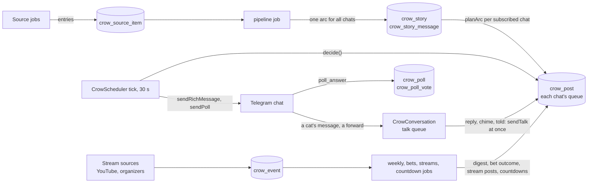

# How the crow is built



Everything the crow will do is a row, not a timer: after a restart it picks up what came due during the
downtime. The code map is in [README.md](README.md#code); the news side (sources → arcs) is in
[pipeline.md](pipeline.md).

## The schedule lives in the database

Tables `crow_post` and `crow_job`; every change goes through `CrowStore`.

- **The posts of an arc form a chain.** Only the first has a `notBefore`; every other one gets its turn
  when the one before it is done (sent, skipped, failed), `gapMs` later (`activation` in
  [planning.ts](../../src/crow/planning.ts)). An overlap of arcs or a downtime shifts the rest of the arc
  instead of bunching it up. Every such transition hands the turn on in the same transaction, so a chain
  cannot stall.
- **A post goes `planned` → `sending` (committed) → `sent`.** A crash in between leaves it `sending`; the
  next start marks it `unconfirmed` and moves its arc on. The bot cannot know whether it arrived, and a
  duplicate is worse than a gap.

  ```mermaid
  stateDiagram-v2
      [*] --> planned
      planned --> sending: decide() picked it
      sending --> sent
      sending --> failed: the send failed
      sending --> unconfirmed: crash, found on the next start
      planned --> skipped: out of date, or optional over the daily limit
      planned --> cancelled: unsubscribed, stale first post, bot removed from the chat
      planned --> merged: told in the morning digest
      planned --> consumed: told in a talk ahead of its turn
      merged --> [*]
      consumed --> [*]
      sent --> [*]
      failed --> [*]
      unconfirmed --> [*]
      skipped --> [*]
      cancelled --> [*]
  ```

  Leaving `planned` or `sending` hands the turn to the next post of the arc: its `notBefore` becomes the
  moment the previous one was done plus its `gapMs`.
- **Not every post is a message of an arc.** A post has a `kind`: `arc`; `jab` — a personal jab in the
  chain of an arc, with its own `text` and the `mention` of its cat; `intro` — the crow telling the chat she
  reads it; `digest` — the morning digest ([behavior.md](behavior.md#the-morning-digest)), a post with its
  own `text` that belongs to no single story; `goodbye` — the evening goodbye
  ([behavior.md](behavior.md#the-evening-goodbye)), due 20 minutes before the quiet hours and expiring
  when they begin. Once a goodbye is sent, the chat's `nextPostAt` is the start of its quiet hours, so
  nothing comes after it that evening (`nextPostTime`). A post's `seq` is its place in the chat's chain of its story,
  jabs among the arc's messages. Calling off a planned jab hands the turn on, as leaving `planned` does.
  The openings it tells are `merged`, with `mergedInto` pointing at it, and share its fate: when it is sent they
  take its `sentAt` and message id, so their arcs go on as replies to it; when it fails they hand the turn on as
  a failed post would; when it goes stale their arcs are cancelled.
- **The crow's talks are posts too** ([behavior.md](behavior.md#talking-in-the-chat)): `reply` — her
  answer to a cat who replied to her or called her — `chime` — her word in a talk uncalled — and `told` —
  her «я ж казала» to a cat who brought news she told ([behavior.md](behavior.md#i-told-you-so)). They are
  created `sending` and go out at once, not at a tick, as replies to the cat's message (`replyToMessageId`,
  `replyToUserId`); `depth` is the place in a thread (her answer to a reply to a post of depth n has
  n + 1), `snippetIds` the details of her store they told. The posts of an arc a talk told ahead of their
  turn become `consumed` in the same transaction, handing the turn on. A cat's reply to any of her posts
  adds to its `replyCount`. They do not count in the chat's hourly and daily limits of arcs, but do move
  its `nextPostAt`, so the next post keeps its gap after them.
- **The rest of her posts** go through the queue: `update` — the UPD to a rumor that came true, outside the
  chain of its story; `weekly` — the weekly digest; `bet` — a bet's poll, in the chain of its arc, sent with
  `sendPoll`; `outcome` — how a bet ended, replying to its poll (`replyToMessageId`); `event` and `reminder`
  — a stream's announcement and reminder (`eventId`), the reminder replying to the announcement. A post of
  its own text keeps what the text refers to in `extras` — the moments of its `{when:…}`, the links of its
  `{link:…}`, the cats of its `{cat:…}`, its table and heading, the weekly digest's vote — and the memory
  reads the placeholders in words (`readableText`). A stream's moments come from its row when the post
  goes, so a stream that moved goes out with its new start.
- **Which posts the limits count, and which carry «Кш!»** (`POST_KINDS` in [dispatch.ts](../../src/crow/dispatch.ts),
  a row a kind, so a new kind decides both): the limits count the news — `arc`, `jab`, `digest`, `update`, `bet`,
  `quiz`. The introduction, the goodbye, the weekly digest, a bet's outcome, the streams' posts, the reminders,
  the countdown, the release radar and the birthday are neither counted nor stopped; the talks go past the queue.
- **No cron library:** none of this is cron-shaped — chains with jitter, per-chat zones and quiet hours —
  and a library keeps its schedule in memory, which does not survive a crash.

## The scheduler

`CrowScheduler` ([scheduler.ts](../../src/crow/scheduler.ts)) is started by `CrowCommand`:

- **The tick** runs every 30 seconds on a `setTimeout` chain, so ticks never overlap. It sends at most one
  post per chat per tick, so it stays short.
- **Jobs** (`crow_job`: `nextRunAt`, `lastRunAt`, `lastError`, `state`) run apart from the tick in a
  `BackgroundQueue`, one at a time; a job that is still queued is not queued twice. A job whose turn
  passed during a downtime runs once, not once per missed turn, or skips to its next turn if it says the
  moment has gone (`stillWorth` in [jobs.ts](../../src/crow/jobs.ts)). `state` survives restarts: a feed's
  ETag, the day's spending.
- The jobs: `source:<id>` for every source (every 10–60 minutes; about seventy of them — the rows of all the
  jobs are made once at the start, and a tick reads only the due ones), `pipeline` (every 2 minutes, and at once
  when a poll brought news), `morning` and `evening` (every 5 minutes: the morning digests and the evening
  goodbyes, [morning.ts](../../src/crow/morning.ts), [evening.ts](../../src/crow/evening.ts)), `weekly`
  (every 5 minutes: the Friday digests, [weekly.ts](../../src/crow/weekly.ts)), `bets` (every 10 minutes:
  closing and settling the bets, [bets.ts](../../src/crow/bets.ts)), `stream:<id>` for every stream source
  (15–60 minutes) and `streams` (every 5 minutes: YouTube's schedule again, the stream posts,
  [events.ts](../../src/crow/events.ts)), `profile` (every hour: the chats' profiles,
  [profile.ts](../../src/crow/profile.ts)), `countdowns` (every 30 minutes: the posts of the countdowns' marks,
  [countdowns.ts](../../src/crow/countdowns.ts)), `releases` (every 30 minutes: the release radar on
  Mondays, [releases.ts](../../src/crow/releases.ts)), `birthday` (every 5 minutes: her birthday in each chat,
  [birthday.ts](../../src/crow/birthday.ts)) and `cleanup` (daily).
- On start, posts left `sending` become `unconfirmed`. `dispose()` waits for the answer being written,
  then stops the tick and waits for the post and the job in progress.
- **Talks:** `CrowCommand` hears every message of a group after the other commands (`bot.on('message')`,
  passing it on). `CrowConversation.hear` decides at once, with a few reads, whether it is for the crow —
  a reply to her post (found by `(chatId, tgMessageId)`), a call, a forward or a link of a story she told
  in the last 30 days, or the aliases of a story she posted in the last 48 hours — and hands the answer, a
  model call of seconds, to the command's own `BackgroundQueue`, freeing the update's slot. The queued answer reads the chat again, since a «Кш!» or
  the quiet hours may have come in between, then checks its limits, writes, and sends through
  `CrowScheduler.sendTalk`, which shares the sending, the `nextPostAt` and the move of «Кш!» with the tick.
- **Sending** (`CrowCommand.sendPost`): `sendRichMessage` with the «🔇 Кш!» button, a reply to the arc's
  first post (`allow_sending_without_reply`), and `disable_notification` unless the post rings. The first
  post uploads the story's picture, and its `file_id` is kept for the next chats; a morning digest uploads
  a collage of its stories' pictures the same way. The first post of a story — its opening, or the digest
  that tells it — ends with the links to the stories' pages (`newsLinks`, from `crow_story.sources`); the
  model's texts carry none. Once a post is sent, the chat's post before it loses
  «Кш!» (`editMessageReplyMarkup`), so the button lives under the latest post only; a failure to take it off
  is logged and leaves it there. A 403 means the bot is no longer in the chat: its subscriptions go and its
  planned posts are cancelled. What follows a sent post — the picture's `file_id` kept, the week's vote sent
  under the weekly digest — failing leaves the post sent.
- **Polls** (`CrowSender.sendPoll`): a quiz goes as an anonymous quiz poll in its arc's thread, its options
  shuffled and the crow's word shown after an answer; a bet goes as a non-anonymous poll in its arc's thread, only while the
  chat has no other bet going and there are 12 hours to bet — otherwise it is dropped like an out-of-date post
  and the chain goes on; the weekly digest's vote, anonymous, under the digest. Each is kept in `crow_poll`
  with Telegram's `pollId`, which the `poll_answer` updates name: a cat's vote on an open bet goes into
  `crow_poll_vote`, a vote taken back is deleted. The weekly job stops the last vote with `stopPoll` for its
  result; the bets job stops a bet whose closing Telegram does not do itself.
- **Edits:** an announcement of a stream that moved or was called off is sent again with `editMessageText`
  and the new rich message, keeping «Кш!» when it is still the chat's latest post.

## Dispatch

`decide()` in [dispatch.ts](../../src/crow/dispatch.ts) picks the post of a chat that goes now, if any:

1. Out-of-date posts are dropped first, even while the chat is quiet, so they do not pile up for the
   morning. The first post of an arc lives 24 hours: after that the arc is cancelled in the chat. An
   optional post is dropped if it could not go out within `max(2 h, its gap)` after its time.
2. Nothing goes while the chat is snoozed, in its quiet hours, or before its `nextPostAt` — the minimal
   gap of 5 minutes plus up to 3 at random after the chat's last post, whatever arc it belonged to.
3. Over the daily limit of the chat's boldness the optional posts are dropped and only the core of mega
   stories goes on; over the hourly limit only the first post of a mega story gets through. The crow's
   introduction, her evening goodbye, the weekly digest, a bet's outcome, the streams' posts, the reminders
   of games that come or go, the countdowns, the release radar and her birthday are not news: the limits neither count nor stop them. A
   quiz is part of its arc and counts. A reminder goes only to a chat that heard its story; otherwise it is
   dropped.
4. Of the rest the highest priority goes: the news of a story (300) before its other posts (200) before
   filler (100), plus 10 per importance point, plus up to 50 for a story the chat has not heard of for a
   while, so arcs take turns.

## Gaps and planning

- **The gaps** ([cadence.ts](../../src/crow/cadence.ts)): a burst of the first posts within the category's
  burst window, then gaps growing about 1.9× each, so the arc fills its window and gets rarer towards the
  end. Every gap is jittered (log-normal, about ±25%), so every chat gets its own rhythm, and none is
  shorter than 5 minutes. With 8 posts over 12 hours and a burst of 3 within 20 minutes the gaps are about
  7, 9, 27, 51, 96, 183 and 348 minutes.
- **The arc is written once, for the boldest chat.** A chat gets `min(max, round(visits × multiplier))`
  of its messages (`visitsFor`): the opening always, then the core messages in order, then the optional
  ones (`pickMessages`).
- **Categories:** a story in several categories is heard with the cadence of the subscribed category that
  allows the most posts (`cadenceCategory` in [planning.ts](../../src/crow/planning.ts)). Unsubscribing
  cancels the planned posts of the stories the chat had only through that category.

## Tables

All date columns are `timestamptz`; there are no foreign keys, as elsewhere in the schema — `CrowStore`
keeps the rows consistent.

| Entity | Table | What it holds |
| --- | --- | --- |
| `CrowChat` | `crow_chat` | A chat's settings: `boldness`, `quietFrom`/`quietTo` (minutes after midnight in the chat's zone, null — none), `snoozedUntil`, `settingsAdminOnly`, `personalJabs`, and `nextPostAt` for the minimal gap; `introducedAt` — when the crow told the chat she reads it; `firstPostAt` — when her first post went out there, her birthday ([behavior.md](behavior.md#birthday)) |
| `CrowChatProfile` | `crow_chat_profile` | The chat's profile for the jabs: interests, running jokes, each cat's topics (games and tech only); `messageCount`, `builtAt` |
| `CrowMemberOptout` | `crow_member_optout` | `(chatId, userId)` of the cats who pressed «🙅 Не чіпай мене» |
| `CrowSubscription` | `crow_subscription` | `(chatId, categoryId)` |
| `CrowStory` | `crow_story` | A story shared by every chat: `storyKey`, `title`, `topicKey` (an AI news's; a game news has none), `vendor`, `hero`, `aliases` (how the cats may call its heroes), `categories`, `importance`, `isRumor`, `eventType` (a game news's: a release date, a delay, a giveaway…), `facts`, `sources`, the picture (`imageUrl`, `imageFileId`), the crow's verdict `stance`, the `bet` it offers, the `quiz` its long arcs carry, the `deadline` its games come or go at with the crow's reminder and the `games` of its list (title, platforms, picture), `confirmedAt` of a rumor that came true; `status` `pending` → `ready` / `failed` / `dropped` |
| `CrowStoryMessage` | `crow_story_message` | The arc: `seq`, `kind` (breaking, fact, practical, versus), `crows`, `text`, `table`, `optional`, `factIds`, `embedding` — the vector of the facts it tells, so a talk finds the post before its turn |
| `CrowSnippet` | `crow_snippet` | The crow's store for talks about a story: `storyId`, `text` — a detail of its sources the arc did not tell — and `embedding`. Which chats heard it, the posts that told it say |
| `CrowPost` | `crow_post` | A chat's queue and the crow's memory of what it posted there: `kind` (`arc`, `jab`, `intro`, `digest`, `goodbye`, `reply`, `chime`, `told`, `update`, `weekly`, `bet`, `outcome`, `event`, `reminder`, `quiz`, `due` — a reminder of a story's games, `countdown` — to a game's release, `birthday` — her year in the chat, `radar` — the week's releases), the chain (`seq`, `gapMs`, `notBefore`, `expiresAt`), `status`, `sentAt`, `tgMessageId`, `shooedBy`, `replyCount`; the own `text` of a post that is not an arc message and its `extras`, a jab's `mention`, `mergedInto` of the news a digest told, the `eventId` of a stream's post; `replyToMessageId` of a talk or a bet's outcome; for a talk `replyToUserId`, `depth`, `snippetIds`. Kept 400 days: her birthday tells the year |
| `CrowPoll` | `crow_poll` | The polls the crow sent: `kind` `vote` (the week's) or `bet`, Telegram's `pollId` and message, `question`, `options`, a vote's `storyIds` and final `counts`; a bet's `storyId`, `crowPick`, `closesAt`, `resolvesAt`, `outcome`; `status` `open` → `closed` → `resolved` / `void`, or `asking` the owner |
| `CrowPollVote` | `crow_poll_vote` | `(pollId, userId)`: a cat's vote on a bet — the name, the username, `optionIds` |
| `CrowEvent` | `crow_event` | A stream: `key` (`youtube:<id>` or the announcing page), `title`, `categories`, `url` to watch, `startsAt`, the `sources` that told of it and their starts, `videoId` for YouTube's schedule and `checkedAt`, the crow's `texts`; `status` `upcoming` / `cancelled` / `over` |
| `CrowJob` | `crow_job` | A job's turn, last run, last error and `state` |
| `CrowSourceItem` | `crow_source_item` | Every entry a source listed: `key`, `title`, `url`, `summary`, `contentHash`, `status` (`seen`, `new`, `irrelevant`, `attached` to a story); `embedding` of a relevant one's headline, for gathering a game news; the `deadline` of a store's list and its `games` |
| `CrowRoster` | `crow_roster` | The current models of each lab ([pipeline.md](pipeline.md#roster)) |

The migration is `AddCrow`, which also seeds the roster. The `cleanup` job removes
posts older than 400 days — a year and a month, since her birthday tells the year of a chat — then the stories no
post refers to, then their messages and their stores, and the settled polls of that age with their votes. A
story's vectors, its messages' and its details', go after 90 days: a talk hears the stories of 48 hours. The
streams go 180 days after they began. The sources' entries stay — a sitemap lists all it ever had, and a
forgotten entry would be news again — but their vectors go after 90 days and their texts after 180 days.

The vectors are EmbeddingGemma's, `halfvec(768)`, null where the model failed. They have no vector index: every
query of them ([vectorSearch.ts](../../src/dataSource/vectorSearch.ts) — `talkMaterialScores`,
`closestGameStories`) narrows to one chat's stories or the entries of the game stories of the last 72 hours first
and compares the few hundred rows left exactly. A forward is compared with the facts of the stories told, whose
vectors are not stored: `FactVectors` ([embeddings.ts](../../src/crow/embeddings.ts)) keeps them in memory by story,
embeds a story's facts again only when they change, and forgets a story no chat has asked for in a month.
