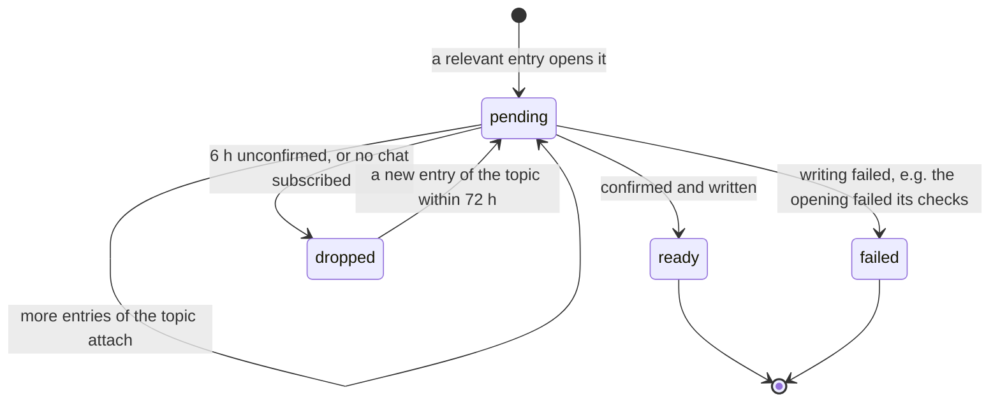
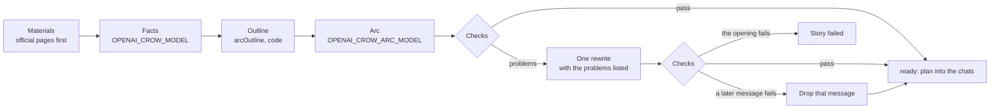

# From a source entry to an arc

The news side of the crow: [pipeline.ts](../../src/crow/pipeline.ts) builds the source jobs and the
`pipeline` job that the scheduler runs ([architecture.md](architecture.md#the-scheduler)).

## Sources

Every source is a job that polls it and remembers its entries in `crow_source_item`
([sources/](../../src/crow/sources/), definitions in [aiSources.ts](../../src/crow/sources/aiSources.ts)):

| Source | Kind | Role | Every |
| --- | --- | --- | --- |
| OpenRouter models | RSS of the model catalog | aggregator: a listing means the model is out, whoever announced it. Free and batch variants, routers and aliases are skipped | 10 min |
| OpenAI News | RSS | official: openai | 10 min |
| Claude release notes | RSS, one entry per day that grows during the day | official: anthropic, compared by content hash | 15 min |
| Anthropic | sitemap; pages at the root or under `/news/` | official: anthropic | 10 min |
| Google: Gemini models, Google DeepMind | RSS | official: google | 15 min |
| DeepSeek | sitemap; `/news/newsYYMMDD` pages | official: deepseek | 30 min |
| Qwen blog | the site's undocumented JSON API: the 40 latest posts, whole, in no order; releases and open models only | official: alibaba; the page needs JavaScript, so the post's own text is the material | 60 min |
| Hugging Face, 21 organizations (Qwen, deepseek-ai, moonshotai, zai-org, google, openai, mistralai, nvidia…) | the models API, newest created first: a new repository is the news | official: the organization's lab — for the Chinese labs often the first word, hours before the catalogs | 15 min |
| Claude Code: commands | the reference table `commands.md`: a name not there before is a new command | official: anthropic; the entry points at the changelog, which tells what came with it | 30 min |
| Claude Code: What's new | RSS, a digest a week, linked to that week's page | official: anthropic | 60 min |
| Codex changelog | RSS: the CLI's minor versions and product posts, patch releases skipped | official: openai; an entry has all its notes | 30 min |
| Cursor changelog | RSS, about a post a week | official: cursor | 60 min |
| Gemini CLI | `docs/changelogs/index.md`: the announcement of each stable version | official: google; the GitHub release is a bare list of pull requests | 60 min |
| GitHub Copilot changelog | RSS: only the Friday «weekly releases» | official: github | 60 min |

- **The first poll of a source only remembers what is there**, so nothing old becomes news. An entry
  dated more than 48 hours back when first seen is not news either.
- Most sources send no ETag, so a feed is fetched whole and its entries are compared by key; where there
  is one, the request is conditional (`fetchText` in [feed.ts](../../src/crow/sources/feed.ts)).
- A poll that brought news makes the `pipeline` job due at once.
- The labs' own channels feed all three AI categories, OpenRouter, Qwen and the Hugging Face organizations 🤖 AI
  Enterprise and 🦙 AI Homebrew: the sorting says which. The coding tools' changelogs feed 🧑‍💻 Вайбкодинг only, and
  a source of one category brings that category's news whatever the sorting called it — GPT-6 in Codex's
  changelog is news of the coding tools.
- Claude Code's changelog is not a source of its own: its versions come several times a week with dozens of
  items each. A new command is found in the table of commands — the changelog's «Added `/x`» often names a
  command that existed before — and the rest of the week comes with «What's new».
- Planned next: x.ai.

**The game sources** ([gameSources.ts](../../src/crow/sources/gameSources.ts)) are counted by their publishers:
the four sites of Hookshot Media are one, IGN, Eurogamer and Rock Paper Shotgun another, Future's sites a third
(`publisher`), so a news is big when many houses write of it, not many sites of one.

| Source | Kind | Role | Every |
| --- | --- | --- | --- |
| VGC, Push Square, Nintendo Life, Pure Xbox, Gematsu, RockstarINTEL | RSS | the press the chat's news mostly comes from; Push Square, Nintendo Life and Pure Xbox are Hookshot Media | 10–30 min |
| PC Gamer, Rock Paper Shotgun | RSS | the PC press: Future, and IGN Entertainment | 15 min |
| GBAtemp, Time Extension | RSS | the scene of 🏴‍☠️ Хакерня: hacks, homebrew, emulators, retro | 15–30 min |
| IGN, Eurogamer, GameSpot, Kotaku, Polygon, Insider Gaming, GamesRadar+, Destructoid | RSS | the rest of the press: its publishers make a news big | 15 min |
| r/GamingLeaksAndRumours | RSS, the top of the day | the leaks and rumors of every category, the magpie's; Reddit is one publisher | 30 min |
| PlayStation Blog | RSS, every post whole | official: sony; the announcements of PS Plus carry the day their games come (the monthly games of Essential on the first Tuesday of their month, the catalog on the third, at the rotation, 08:00 UTC); «(For Southeast Asia)», «Share of the Week» and the podcast are left out | 15 min |
| Nintendo UK | RSS | official: nintendo | 30 min |
| Xbox Wire | RSS, every post whole | official: microsoft; «Next Week on XBOX» names every game of the week with its day, for the release radar | 15 min |
| Steam: its blog, Steam Deck, Steam Machine, Steam Frame, Deadlock, Half-Life: Alyx | RSS of each app's news | official: valve; client updates left out | 60 min |
| Xbox Game Pass: recently added, leaving soon | the catalog's lists, then the display catalog for the titles | a store's own list: the games new to a list since the last poll, together, one entry | 3 h |
| Epic Games Store: free games | the store's JSON for the Ukrainian store | a store's own list: one entry a week's giveaway, with its prices in UAH, the next week's games, and when it ends | 60 min |
| GamerPower | JSON of giveaways | a list: the free games of Steam, GOG, Ubisoft, EA, Battle.net, Xbox, PlayStation and Switch worth ten dollars or more; not Epic's (its own source), not a limited key giveaway | 60 min |
| PlayStation Store: Last Chance to Play | the Ukrainian store's GraphQL, then each new game's page for the moment it leaves (`endTime`), a request a second | a store's own list: one entry a day games leave the Extra and Deluxe catalog on, the two editions of a game in one line | 3 h |
| r/GTA6, r/chiliadmystery, Google News | RSS, from GTA VI's release on (`activeFrom`) | the hunts for its mysteries; Reddit is one publisher, so a find is told once the press confirms it | 30–60 min |

- **Filters before the sorting** (`accept`): the columns of Hookshot's sites that are never news (reviews,
  features, polls, «What Are You Playing»), the press's guides and podcasts, Gematsu's posts of a trailer or of
  gameplay. A guide to the week's releases stays.
- **Reddit** answers an anonymous client about once a minute, so every request to it waits for its turn, a minute
  after the one before, whichever source makes it ([feed.ts](../../src/crow/sources/feed.ts)).
- **The PS Store** takes only the queries its own client knows, by the sha256 of each (persisted queries), and a
  new deploy of the store brings new hashes. The bot finds the hash as the store's client does
  ([psStoreHash.ts](../../src/crow/sources/psStoreHash.ts)): from the `gql` templates of the page's script bundles,
  the query with its fragments, `__typename` added to every selection, the document sorted and printed exactly as
  graphql-js 14 prints it ([graphqlDocument.ts](../../src/crow/sources/graphqlDocument.ts), a few hundred lines in
  place of the dependency; graphql 15 and later print long argument lists on several lines, and their hash is
  another). The hash is kept in the source's job state (`crow_job.state.hash`), never in the code: the first poll
  finds it, and a poll the store answers «unknown query» finds it again — a few megabytes of bundles and 10–20 s —
  and tries once more. A store that takes not even that fails the poll, which is logged and tried again at the
  next turn; nobody is told, since no one has anything to mend. The games leaving PS Plus come from the press
  meanwhile.

**The release radar** reads the roundups of the week among these entries — Xbox Wire's «Next Week on XBOX»,
Push Square's and Pure Xbox's weekly guides — whatever the sorting made of them, and the week of Nintendo's
European store, asked of the search its site uses — `searching.nintendo-europe.com`, public JSON, no key —
when the radar is prepared ([nintendoStore.ts](../../src/crow/sources/nintendoStore.ts),
[behavior.md](behavior.md#the-release-radar)). Nintendo Life has no weekly guide in its feeds, and its pages are
behind Cloudflare.

**Streams** have sources of their own ([streamSources.ts](../../src/crow/sources/streamSources.ts)), each a
job `stream:<id>` that finds streams rather than news ([behavior.md](behavior.md#streams)):

| Source | Kind | What it gives | Every |
| --- | --- | --- | --- |
| YouTube: PlayStation, Nintendo of America, Xbox, OpenAI, Google, Anthropic | the YouTube Data API (`YOUTUBE_API_KEY`): the channel's uploads playlist, its latest 15 at a unit, then the new videos, 50 a unit, of the free 10 000 a day — about 600 a day for the six | an upcoming live stream — its length is `P0D`, a premiere has one — and its `scheduledStartTime`; the game channels' by the show's name (State of Play, Nintendo Direct, Xbox Games Showcase, Developer Direct), the labs' all | 15 min |
| PlayStation Blog | the State of Play tag's feed: an entry of the last week that names the show and a time | the start with its zone, read by the model | 60 min |
| Nintendo Direct | `nintendo.com/us/nintendo-direct/` redirects to the current Direct: a new target is a new one | the start from the page's description, read by the model | 60 min |
| Xbox Wire | the Xbox Games Showcase tag's feed: a post that names the show and a time («How to Watch») | the start with its zone, read by the model | 60 min |

Without the key only the announcements work. The channel's RSS (`feeds/videos.xml`) would be free, but it
answers 404 to every channel for days at a time, as in December 2025, February and September 2026.

## Sorting and stories

The AI news and the game news are sorted apart: a batch's entries of the game sources go to their own prompt
([below](#game-stories)); what follows here is the AI news.

The `pipeline` job runs every 2 minutes:

1. **Sorting.** New entries of categories that no chat wants are marked seen without calling the model.
   The rest go to `OPENAI_CROW_MODEL` in batches of 25 (`SORT_PROMPT`): relevant or not, category, vendor,
   topic key, title, hero model, importance by the category's rubric, rumour or not. The rubrics: AI
   Enterprise — 3 a new flagship of a top lab, 2 a smaller model or a big feature, 1 API, prices, minor
   versions; AI Homebrew — 3 an open model that beats closed ones or fits 12–24 GB with a clear gain, 2 a
   new version of a known family, 1 quantizations and support in llama.cpp, LM Studio, Ollama; Вайбкодинг
   — 3 a new command or a big feature of Claude Code, a change of limits or plans, 2 a notable feature of
   Codex, Cursor, Gemini CLI, Copilot or the week of Claude Code, 1 trifles. Models of little-known companies,
   bug-fix releases and models not for text, code, voice or pictures are not relevant.
2. **Stories.** Entries with the same topic within 72 hours make one story. The topic key drops tiers,
   dates, builds, quantizations and sizes, and glues a name to its version however it was written, so GPT-6
   Sol and Luna are `openai/gpt6`, and Qwen3.9-27B, its 35B-A3B and NVIDIA's FP4 build of it are one story
   ([modelKey.ts](../../src/crow/modelKey.ts)).
3. **When a story is written** ([stories.ts](../../src/crow/stories.ts)): at once when the vendor's own
   channel has it; after an hour when only a model catalog does (an announcement usually follows); as a
   rumour when two sources agree for 45 minutes; dropped after six hours unconfirmed. A story no chat is
   subscribed to is dropped.

## Game stories

A game news has no topic key — ten publishers name it ten ways — so its entries are gathered by meaning
([clustering.ts](../../src/crow/clustering.ts)) and it is written once enough publishers wrote of it
([stories.ts](../../src/crow/stories.ts), `gameStoryVerdict`).

1. **Sorting** (`Sort Crow Game News`, `OPENAI_CROW_MODEL`, `gameSortPrompt`): relevant or not — guides, reviews,
   deals, opinions, films, esports, PC hardware and small patches are not; hacking is the scene's — hacks,
   homebrew, emulators, leaks of code — not the rumors of games; the categories of the news, several
   for a multiplatform one, kept to those of its source and those some chat hears; the hero; a title in English of
   what happened, in the same words whoever wrote it («Sony raises PS5 prices in Europe»); the kind of event; the
   importance by the category's rubric; rumor or not. GTA VI's rubric turns to its mysteries once it is out: a
   solved mystery the press confirmed is news, a theory is not.
2. **Gathering:** each relevant entry gets EmbeddingGemma's vector of its title and the sorted title
   (`entryText`), then finds its story among the game stories of the last 72 hours: the same link settles it,
   then a headline nearly the same (trigrams ≥ 0.6, as pg_trgm counts them), then the meaning — 0.75 or closer
   is the same news; 0.60–0.75 is asked of the model, every doubtful entry of a run in one call (`Match Crow
   Story`: the same event, not the same game); below that it starts a story of its own. A store's own list is
   always a story of its own, and carries its games — each one's title, platforms and picture: the PlayStation
   Blog's post names them in its article («Title | PS5, PS4» and the picture before it), Epic's API and Game Pass's
   lists give them — for the table and the gallery of its opening ([behavior.md](behavior.md#game-news)). An entry the sorting left out that is surely of a story — by its link, its headline
   or 0.75 — still counts for the story's publishers and changes nothing else of it: one batch's sorting is not
   another's, and on a real day it called the same news relevant in two of five publishers' entries. Measured on today's feeds: the same news of three publishers came 0.90 and 0.90
   close, another news of the same platform 0.51.
3. **When it is written:** a store's own list, and a platform's own post of a notable news (importance 2 or
   more), at once; the press once enough publishers wrote of it within six hours of its first entry — three for
   a platform, two for GTA VI, the freebies and the release radar, one for the scene — and not before twenty
   minutes, so the others have come. Five
   publishers within three hours, or a platform's own post and three publishers, make it a mega news (importance
   3). Unconfirmed after six hours, it is dropped.
4. **Writing:** as the AI news below, with the official entries first in the materials and then those with the
   most to read; no comparison with a competitor, since the roster is the labs' models (`arcOutline` without
   `versus` when there is no roster).

## Writing a story

1. **Materials:** up to 4 sources, official first. Official pages are read (the `article` or `main` of the
   page, up to 8000 characters) where the site allows — openai.com refuses a bot.
2. **Facts:** `OPENAI_CROW_MODEL` extracts up to 16 facts (`FACTS_PROMPT`): one sentence each, only what
   the materials say, with attribution kept («за словами Anthropic») where dropping it would turn a claim
   into a fact, no times of day. The request carries today's date (UTC), and the tense is the source's: a
   release still ahead stays «вийде», however much the press's hands-on reads as if the game were out — without
   the date luna once wrote «вийшла 29 вересня» on the 28th.
3. **The outline** — the code, not the model, decides the shape of the arc
   ([arcOutline.ts](../../src/crow/arcOutline.ts)): the news with the first six facts (3–8 bullets, up to
   ~1500 characters, sent with the picture — with three facts and 600 characters, half of which her word took,
   the opening read squeezed), a message for each of the other facts in the order of
   importance (`practical` when the fact is a price, a date or where to get it), and a comparison with one
   competitor after the first two; the later third of the facts is optional. The arc has as many messages
   as the boldest chat would get and no more than its facts carry. An arc of three messages at most — an
   open model, a release of a coding tool, a trifle — is the news and the next facts, with no comparison.
   **No arc ends with a farewell:** its last gap is the longest and mostly ran out in the night, so the
   goodbye came at ten in the morning; the crow says goodbye once a day in each chat instead, before its
   quiet hours ([behavior.md](behavior.md#the-evening-goodbye)).
   Left to lay out the facts itself, luna circled back to the ones it had told — three reminders in a row
   — and more reasoning (`high`) made it worse; a message of its own for a fact of the opening only retold
   the opening, so every fact is told once.
4. **The arc** ([arcWriter.ts](../../src/crow/arcWriter.ts): `arcRequest`, `writeArc`):
   `OPENAI_CROW_ARC_MODEL` writes one text per line of the outline (`PERSONA_PROMPT` + `arcPrompt`), given the facts, the roster, the openings of the last 8 arcs (not to repeat them) and the
   crow's last 5 verdicts in these categories with how long ago she gave them, «(5 днів тому)» (to switch
   sides knowingly: a date means nothing to a model that is not told what day it is). It also returns its
   verdict on the hero (`stance`) for the next stories.
5. **The checks** ([arcValidation.ts](../../src/crow/arcValidation.ts)): as many messages as the outline;
   every number from the facts, the title, the roster or the past verdicts (or 0–10); no time of day in digits; no politics or
   slurs; up to 1200 characters, the opening 2500; tables of 2–4 columns and up to 8 rows. The number of crows is counted from
   the text rather than asked for: the model's number and its text disagreed in half the messages. A
   failing arc is rewritten once with the problems listed; what still fails is dropped, and a failing
   opening fails the story.
6. The story becomes `ready`, its picture is saved, the roster may change, and `OPENAI_CROW_MODEL` writes
   the crow's store for talks about it (`SNIPPETS_PROMPT`): 6–12 details of the same materials that its
   facts left out, dry like them, and the aliases the cats may call its heroes by
   ([behavior.md](behavior.md#talking-in-the-chat)). A store that cannot be written leaves the story its
   hero's name for an alias, never costs it the arc. A mega story that is not a rumor gets a quiz on the facts
   of its opening (`Write Crow Quiz`, [quiz.ts](../../src/crow/quiz.ts)), kept with the story for the chats whose
   chains have five posts or more ([behavior.md](behavior.md#quizzes)). A story whose store's list or platform's
   post says when its games come or go (`deadline`) gets the crow's reminder of it, written once (`Write Crow
   Reminder`, [deadlines.ts](../../src/crow/deadlines.ts)) and planned into each chat apart from the chain, at
   its time ([behavior.md](behavior.md#game-news)). A failed quiz or reminder costs the story only itself. A story that is not a rumor may get a bet on its dated
   event (`betPrompt`, [behavior.md](behavior.md#bets)): kept with the story if its day is 2–92 days ahead and
   named by a fact; a failure costs the story its bet, never the arc. Then the arc is planned into
   every subscribed chat ([architecture.md](architecture.md#gaps-and-planning)) — with the personal jabs of
   each chat that has a profile and the jabs on ([behavior.md](behavior.md#the-chat-profile-and-the-jabs)).
   A jab that cannot be written costs the chat its jab, never the story. The bet goes into the chain of each
   chat with no bet going and fewer than two in the week. The arc is written for the
   category its chats hear the most of: an open flagship may be a day of AI Enterprise in one chat and a
   post or two of AI Homebrew in another.
7. **A rumor that comes true:** every run the pipeline looks at the stories written as rumors in the last 72
   hours whose topic got an entry of the vendor's own since — attaching an entry to a written story keeps it
   a rumor until then. The vendor's pages are read for facts, which join the story's under new ids, the story
   is a rumor no more, and one UPD is written for every chat that heard it and still hears its category
   ([behavior.md](behavior.md#i-told-you-so)). A rumor that cannot be confirmed is not tried again.

The persona and the arc prompt were reworked by ChatGPT from a brief of luna's failings; two lines were
added after testing: the chat's swear words listed with euphemisms ruled out, and half the posts opening
with the crow rather than the fact ([behavior.md](behavior.md#the-persona)).

## Roster

`crow_roster` holds the current models of each lab, and every arc prompt gets it: a model's own knowledge
of these releases is stale, and without the list it would mock competitors that were retired long ago.
The seed is in the migration `AddCrow`, one entry per lab, newest first
(«GPT-6 Astra (старший тариф), GPT-6 Sol, GPT-6 Luna»).

A mega story of AI Enterprise that is not a rumour and is **confirmed by the lab's own channel** updates
its entry ([roster.ts](../../src/crow/roster.ts)): a newer version of a model's line replaces the older one
(Claude Opus 5 → 5.5), a model of a new line goes in front, the lab's other lines stay (Opus 5.5 does not
retire Fable 5.1), and at most 4 models are kept. A catalog alone does not update it: OpenRouter's
reasoning mode of GPT-6 Luna, sorted as a new flagship, once took the place of all of OpenAI's models.

## Budget and pictures

- **Budget** ([budget.ts](../../src/crow/budget.ts)): every LLM call reports its cost
  (`OpenAIService.parse`). Past `OPENAI_CROW_DAILY_BUDGET_USD` in a UTC day no new arcs are written; the
  stories wait for the next day. The day is the bot's own, UTC, not any chat's. The spending lives in the `pipeline` job's state and counts even when a
  run fails. A day of news costs about a quarter of the default; the limit guards against a bug that writes
  in circles.
  - The first time a day the pipeline finds the money spent, it tells the owner in the private chat
    ([owner alerts](../telegram.md#owner-alerts), `crow-budget`): spent and limit, when the new day begins,
    the stories waiting and for how long, the posts of written arcs still planned. «🔄 Скинути бюджет» forgets today's spending
    (`CrowStore.resetBudget`), «▶️ Запустити конвеєр» makes the job due at the next tick
    (`CrowStore.resumeJob`). The buttons are in the owner's private chat; the handler still checks who
    pressed, since callback data is not signed and a modified client can send any from under a group's
    `/crow` menu.
  - OpenAI's balance itself cannot be shown: no API gives it to an API key or an admin key.
- **An empty OpenAI balance** (a 429 `insufficient_quota`, `isQuotaError`) is not a story's fault: the story
  stays pending instead of failing, and the pipeline pauses for an hour (`pausedUntil` in its state), so it
  does not knock every two minutes. The owner hears of it from `OpenAIService` for the whole bot
  (`openai-quota`); «▶️ Запустити конвеєр» under that alert ends the pause at once, after a top-up.
- **Pictures** ([images.ts](../../src/crow/images.ts)): the official page's `og:image` is downloaded,
  turned into a JPEG (1280 px wide) with `sharp` and kept in `data/crow/images/<story>.jpg` until the first
  post uploads it; the later posts and chats use its `file_id`. The daily `cleanup` forgets the pictures of
  stories whose arcs were called off, two days on.

## Models and costs

| Call | In Langfuse and the log | Model | Cost |
| --- | --- | --- | --- |
| Sorting, a batch of 25 entries | `Sort Crow News` | `gpt-6-luna`, `low` | ≈ $0.002 |
| Facts of a story | `Extract Crow Facts` | `gpt-6-luna`, `low` | $0.0003–0.0006 |
| An arc | `Write Crow Arc` | `gpt-6-sol`, `medium` | $0.018–0.035, ≈ $0.025 on average |
| Its one rewrite, when the checks sent it back | `Rewrite Crow Arc` | the same | about as much again |
| The crow's store for talks about a story | `Extract Crow Snippets` | `gpt-6-luna`, `low` | ≈ $0.0008 |
| An answer in a talk, or a chime-in, and their rewrites | `Write Crow Reply`, `Rewrite Crow Reply`, `Write Crow Chime-In`, `Rewrite Crow Chime-In` | `gpt-6-luna`, `low` (`OPENAI_CROW_TALK_MODEL`) | $0.0003–0.0005 a message heard |
| The jabs of a chat's arc, and their rewrite | `Write Crow Jabs`, `Rewrite Crow Jabs` | `gpt-6-sol`, `low` (`OPENAI_CROW_TEXT_MODEL`) | ≈ $0.006 a chat |
| A chat's profile, once a week | `Build Crow Chat Profile` | `gpt-6-luna`, `low` | $0.001–0.006 |
| A chat's morning digest | `Write Crow Morning Digest`, `Rewrite Crow Morning Digest` | `gpt-6-sol`, `low` (`OPENAI_CROW_TEXT_MODEL`) | ≈ $0.008 |
| A chat's evening goodbye | `Write Crow Goodbye`, `Rewrite Crow Goodbye` | `gpt-6-sol`, `low` (`OPENAI_CROW_TEXT_MODEL`) | ≈ $0.006 |
| «Я ж казала» to a forward or a link | `Write Crow Told You`, `Rewrite Crow Told You` | `gpt-6-luna`, `low` (`OPENAI_CROW_TALK_MODEL`) | ≈ $0.0002 |
| The UPD to a rumor that came true, for every chat | `Write Crow Rumor Update`, `Rewrite Crow Rumor Update`, with `Extract Crow Facts` of the vendor's page | `gpt-6-luna`, `low` | ≈ $0.001 |
| A chat's weekly digest | `Write Crow Weekly Digest`, `Rewrite Crow Weekly Digest` | `gpt-6-sol`, `low` (`OPENAI_CROW_TEXT_MODEL`) | ≈ $0.008 |
| A bet on a story's dated event, or none | `Write Crow Bet`, `Rewrite Crow Bet` | `gpt-6-luna`, `low` (`OPENAI_CROW_TALK_MODEL`) | ≈ $0.0001, ≈ $0.0004 with a bet |
| How a bet ended, and the crow's word on it | `Resolve Crow Bet` (`OPENAI_CROW_MODEL`, `gpt-6-luna`), `Write Crow Bet Outcome`, `Rewrite Crow Bet Outcome` | `gpt-6-sol`, `low` (`OPENAI_CROW_TEXT_MODEL`) | ≈ $0.006 |
| A stream in an organizer's announcement | `Extract Crow Stream` | `gpt-6-luna`, `low` (`OPENAI_CROW_MODEL`) | ≈ $0.0001 |
| Sorting the game news, a batch of 25 entries | `Sort Crow Game News` | `gpt-6-luna`, `low` | ≈ $0.002; the 89 fresh entries of a day's saved feeds cost $0.005 |
| Whether doubtful entries tell a game story's news, all of a run | `Match Crow Story` | `gpt-6-luna`, `low` | ≈ $0.0002 |
| A mega story's quiz, and its rewrite | `Write Crow Quiz`, `Rewrite Crow Quiz` | `gpt-6-sol`, `low` (`OPENAI_CROW_TEXT_MODEL`) | $0.005–0.009 |
| The reminder of a story's games, for every chat | `Write Crow Reminder`, `Rewrite Crow Reminder` | `gpt-6-sol`, `low` (`OPENAI_CROW_TEXT_MODEL`) | $0.002–0.007 |
| Her word on her birthday in a chat | `Write Crow Birthday`, `Rewrite Crow Birthday` | `gpt-6-sol`, `low` (`OPENAI_CROW_TEXT_MODEL`) | ≈ $0.006 a chat a year |
| A post of a countdown's mark, for every chat | `Write Crow Countdown`, `Rewrite Crow Countdown` | `gpt-6-sol`, `low` (`OPENAI_CROW_TEXT_MODEL`) | $0.002–0.007 a mark |
| The week's releases from the roundups | `Extract Crow Releases` | `gpt-6-luna`, `low` (`OPENAI_CROW_MODEL`) | ≈ $0.0007 a week |
| The release radar's word, for every chat | `Write Crow Release Radar`, `Rewrite Crow Release Radar` | `gpt-6-sol`, `low` (`OPENAI_CROW_TEXT_MODEL`) | ≈ $0.005 a week |
| The crow's words about a stream, for every chat | `Write Crow Stream`, `Rewrite Crow Stream` | `gpt-6-luna`, `low` (`OPENAI_CROW_TALK_MODEL`) | ≈ $0.0003 |

**Why sol for the arcs.** A blind A/B on 6 real AI stories (26.09.2026): luna, sol with the same prompt,
and sol with a shortened prompt, all at `medium`, on the same facts, outline and memory. Two Opus judges
ranked the arcs by voice and humour and counted factual slips. Sol with the full prompt came first in all
12 judgements, and every one of its arcs could go to the chat as it was, against 7 of 12 for luna; it had
one minor slip against luna's four. The shortened prompt made sol lose even to luna: its swearing got
monotonous and a quarter of its posts opened with «Коти…». So the prompt is the same for both models.

**Why the task comes after the story.** The request ends with ~1k tokens that are the same for every
story — the task, the hard limits, the check before answering, the format — so the prompt cache, which
keeps only a prefix, never has them. Moved ahead of the story, to the end of `PERSONA_PROMPT`, they were
cached (5.7k tokens of the ~7.5k instead of 4.7k, ≈ $0.002 off an arc written within half an hour of
another), but lost the same blind A/B on sol (27.09.2026): both judges preferred the arcs with the task
last in four stories of six, and the other arcs more often opened with a bare fact and swore less. Read
last, the task holds the voice; the cache is not worth it.

**The limits a prompt states are the code's.** [prompts.ts](../../src/crow/prompts.ts) takes every number its
checks hold the answer to from the module that checks it — an arc's 1200 characters, the opening's 2500 and its
six facts, a table's columns and rows, the counts of the profile, the quiz, the bet and the store, the streams'
lengths — so a prompt and its check cannot drift apart. Where a prompt asks for less than its check lets
through, so a slightly long answer still passes (a quiz's question 250 of Telegram's 300, the opening about 1500
of 2500), the number asked for is declared beside the limit (`QUIZ_ASKED`, `BET_ASKED`, `SNIPPETS_ASKED`,
`OPENING_LENGTH`, `JAB_LENGTH`, `RELEASES_ASKED`). A number no code checks — a title's 80 characters, «1–2
речення» — lives in the prompt alone. Those modules import nothing of prompts.ts but its types, and a new one
must not either: the prompts are built when the module loads.

**A month with every category on** (the stories of all game and AI categories, 7–10 a day): about
$5–9, of which the arcs on sol are $4–7; each story a day adds $0.6–0.8 a month. The cost does not grow
with the number of chats — an arc is written once for all of them. The daily budget caps the pipeline at
about $30 a month even if a bug writes in circles. The talks are outside it and grow with the chats: a
model call only for a message that replies to the crow, calls her or names a story she posted, so a
chat where she answers thirty times a day costs about $0.4 a month. The weekly digest, the bets and the
streams add cents a month per chat.

**Changing the arc model** (a new sol version, a cheaper model): run the crow's blind A/B in the
`update-openai-pricing` skill first (its section «The crow's arcs»). `evaluate-crow.ts` writes the arcs
of six real stories ([crow-stories.json](../../.claude/skills/update-openai-pricing/fixtures/crow-stories.json))
with both models through [arcWriter.ts](../../src/crow/arcWriter.ts) — the same request, prompts, checks
and rewrite as here — two Opus judges read them blind, and `score-crow.ts` says whether the crow got worse.
A change to how arcs are written is therefore tested by the same run.

## Adding a source or a category

- **A source:** a `SourceDefinition` in `sources/` — `kind` (feed, sitemap, `custom` with its own `parse`
  for a JSON API or a Markdown page, [parsers.ts](../../src/crow/sources/parsers.ts), or `fetch` for a source of
  several requests, which keeps what it needs in the job's state), `intervalMs`, `official`
  with the vendor if it is the lab's or the platform's own channel, `aggregator` for a catalog, `updatesInPlace` for an entry
  that grows during the day, `selfContained` when the entry is the whole story and its page is not worth
  reading, `accept` to skip what is never news; for a game source `publisher` (its house, if it has sister
  sites), `structured` for a store's own list, `activeFrom` for one that waits for its moment. Add it to the list the command passes to
  `CrowPipeline`; its first poll only remembers what is there.
- **A category:** an entry in `CATEGORIES` ([categories.ts](../../src/crow/categories.ts)) with its button,
  caption, cadence and toasts; the sorting prompt's category list and its rubric of importance; sources that
  name it in `categories`.
- **A stream source:** a `StreamSource` in [streamSources.ts](../../src/crow/sources/streamSources.ts) —
  `youtube` with the channel's id and, for a busy channel, `accept` by the show's name; `feed` with
  `mayAnnounce`, which keeps the model off entries that cannot announce a stream; or `redirect` for a page
  that points at the current show. Name its categories; the `streams` job does the rest.
