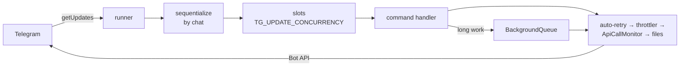

# Telegram plumbing

How updates come in and calls go out, what happens on errors and at shutdown. The short rules every
command follows are in [CLAUDE.md](../CLAUDE.md#telegram-essentials); this is the detail behind them.

Incoming updates are taken in by `UpdateQueue` ([updateQueue.ts](../src/bot/updateQueue.ts)), outgoing calls go
through [apiTransformers.ts](../src/bot/apiTransformers.ts); [bot.class.ts](../src/bot/bot.class.ts) wires them
together. Helpers live next to their users in `src/bot/` (`telegramFiles.ts`, `telegramLinks.ts`,
`backgroundQueue.ts`), not in a global `src/utils`.

## Update queue

`@grammyjs/runner` polls, and two middlewares gate every update: `sequentialize` by chat (updates of one
chat run in order), then slots sized by `TG_UPDATE_CONCURRENCY` (default 1 = strictly sequential).

- The slots are not redundant: the runner starts every update of a `getUpdates` batch (up to 100) at
  once — its `concurrency` only sizes the next fetch — so after downtime the backlog would mean dozens of
  concurrent Whisper/CLIP runs.
- `sequentialize` comes first, so an update waiting for its chat's turn does not hold a slot.
- Long work goes to a `BackgroundQueue` ([backgroundQueue.ts](../src/bot/backgroundQueue.ts)), which
  frees the slot: jobs run one at a time, in order, a failed one is logged (or apologised for, via
  `apologize` from bot.class.ts) without holding up the rest, and the owning command closes the queue when
  disposed, so the shutdown waits for the job in progress. `/searchmedia` pages, transcriptions and
  `/trends` analyses (tens of seconds of LLM calls) use it. A search page probes each result whose message
  may be gone with a reply sent and taken back, paced by the throttler, so in a chat with many deleted
  messages one page takes minutes.
- `/starthistoryimport` runs for hours, so it is started without `await` and not waited for at shutdown.

## Outgoing calls

They go through a chain of API transformers on `bot.api`, which apply to `ctx.api` too:

- `@grammyjs/auto-retry` retries a 429 after Telegram's `retry_after`, up to 5 times. Nothing else is
  retried: a `sendMessage` that failed on the network may still have been delivered. The wait holds the
  caller's slot, so the whole queue pauses.
- `@grammyjs/transformer-throttler` paces the methods that post messages (`isSendMethod`: `send*` except
  `sendChatAction`, plus copy/forward) to Telegram's limits: 20 a minute and one a second per group, one a
  second per private chat. Reactions and edits are not paced. This is why the code makes no pauses between
  replies.
- `ApiCallMonitor` counts the requests that go out, logs `Telegram API: N calls/min (...)` every minute
  while the bot is doing anything, and warns on each 429.
- `@grammyjs/files` adds `getUrl()` to `getFile` results (see below).

## Errors

`bot.catch` logs a failed update and apologises in the chat only for commands and button presses.
`bot.start()` rejects when polling cannot go on (401 for a revoked token, 409 for another instance
polling), and [app.ts](../src/app.ts) then exits with code 1.

## Stop

On SIGINT/SIGTERM, in [app.ts](../src/app.ts):

1. Polling stops, and updates that have not started are dropped (Telegram already counts them as
   delivered).
2. The ones in progress finish, then the commands are disposed, closing their background queues: the
   search page, transcription or trends analysis in progress finishes too, queued transcriptions get a
   notice in place of their 💬, and queued analyses turn back into the period picker. All of it shares
   25 s (`STOP_TIMEOUT_MS`, under `stop_grace_period: 30s` in docker-compose).
3. The AI models are released after that, once: `AIService` is a singleton shared by several commands, so
   no command disposes it.
4. The database closes, the traces are flushed and the process exits. No step throws — each logs its own
   failure — so every step runs.

## Files: the 20 MB limit

Live handlers download media through `downloadTelegramFile` ([telegramFiles.ts](../src/bot/telegramFiles.ts)):
media tracking, `/ignoremedia`, speech recognition, image descriptions for trends. A file link carries the
bot token, so it never leaves that function, and images go to OpenAI as base64 data URLs.

The cloud Bot API only serves files up to **20 MB**, so larger videos cannot be processed live and the
handler fails into `bot.catch`. History import is not affected: it downloads through gramjs (MTProto),
which has no such limit. Running a local `telegram-bot-api` server with `--local` would lift the limit to
2 GB without code changes: such a server hands out absolute file paths, which the helper reads from disk.

## Owner alerts

Trouble only the owner can fix goes to `TG_OWNER_ID` in the private chat with the bot, through `OwnerAlerts`
([ownerAlerts.ts](../src/bot/ownerAlerts.ts)):

- **Once a day per kind.** The time of the last alert of a kind is kept in `owner_alert` and claimed in one
  statement before sending, so a restart, a crash loop or two failures at once do not repeat it.
- The owner must have started a private chat with the bot; otherwise Telegram refuses, and the failure is
  logged with that hint.
- Without `TG_OWNER_ID` nothing is sent and nothing is written to `owner_alert`: the bot warns at start,
  and each kind of alert is logged once a run with its first line — not with every failing call.

| Kind | When | Sent by |
| --- | --- | --- |
| `openai-quota` | An OpenAI call fails with 429 `insufficient_quota`: the balance or a spending limit is exhausted | [app.ts](../src/app.ts), listening to `OpenAIService.onQuotaExhausted` |
| `crow-budget` | The crow's daily budget is spent while stories wait | the crow's pipeline ([crow/pipeline.md](crow/pipeline.md#budget-and-pictures)) |

Every OpenAI call goes through `OpenAIService.call`, the only way to the client, which awaits it through
`watch`: that recognises an empty balance (`isQuotaError`), tells the listeners and rethrows, so each caller
fails as before. The balance itself cannot be shown: no
OpenAI API gives it to an API key or an admin key, so the alerts link the billing page.

## grammY version

grammY is pinned to `~1.46.0`: its types follow the Bot API and change in minor releases. grammY 2.0
(September 2026: betas on JSR only) is not used yet, because the `runner`, `auto-retry`,
`transformer-throttler` and `files` plugins do not work on it. What moving to 2.0 changes is kept in few
places: the transformer setup in [apiTransformers.ts](../src/bot/apiTransformers.ts) (`api.config.use` →
`api.transform`, with a new transformer signature), `GrammyError` only in [bot.class.ts](../src/bot/bot.class.ts),
`Filter` only in [context.interface.ts](../src/bot/context/context.interface.ts), and `ctx.reply` →
`ctx.sendMessage`.

## Tests

- [updateQueue.test.ts](../src/bot/updateQueue.test.ts) runs the real grammY bot and runner against a fake
  Bot API with a backlog of several chats: the slot limit holds for a whole batch, one chat stays in order,
  and a stop drops what has not started. Its chats are chosen so that each of these breaks the test when
  removed — a single chat would pass without the slots, since `sequentialize` alone keeps it in order.
- The API transformers (which methods are paced, what is counted) with a fake Bot API, and the file
  download helper against a local HTTP server.
