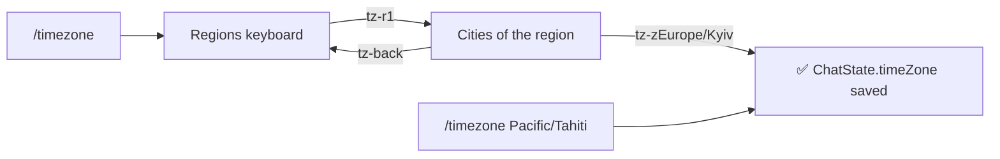

# `/timezone` — the chat's time zone

A bot is not told where its users live, and one bot serves chats in different zones, so each chat says
it itself. Code: [timeZone.command.ts](../src/bot/commands/timeZone.command.ts) (the command and its buttons)
and [timeZones.ts](../src/bot/commands/timeZones.ts) (the zones offered, the names kept, `zoneLabel`, free of
grammY and TypeORM); the zone is kept in `ChatState.timeZone` (null until a chat sets it).

## The command

- `/timezone` answers with the chat's zone and a keyboard of regions (Європа, Америка, Азія, Інші); a region
  opens its cities, two a row, each with its offset now — «Київ (GMT+3)» — and «⬅️ Назад».
- `/timezone Pacific/Tahiti` sets a zone that has no button. The name is matched without regard to case,
  and the current names win over the old ones ICU still reports (Europe/Kyiv, not Europe/Kiev); a name
  no zone has is refused with a hint.
- The answer shows the time there now, as a check: «✅ Часовий пояс чату: Europe/Kyiv (зараз 23:10)».
- Anyone in the chat may set it. The callback data (`tz-r<region>`, `tz-z<zone>`, `tz-back`) fits the
  64 bytes Telegram allows; a test checks every button's zone exists and fits.

## Who uses it

- **The crow** counts its quiet hours and "today" (the daily limit of posts) in the chat's zone. A chat
  that has set none is counted in **UTC**: the bot does not guess. While the quiet hours are on and the
  zone is not set, the `/crow` menu says so, marks the quiet hours «UTC» and offers «🕰 Задати часовий
  пояс», which posts this command's region picker into the chat; if Telegram refuses, the toast tells the
  cat to run `/timezone`. With a zone set, the quiet hours button names it by `zoneLabel` — the city of its
  button, «Київ», or the last part of the name ([crow/behavior.md](crow/behavior.md#crow)).
- **The bayans of the month** go on its last day at 19:42 of the chat's zone ([media.md](media.md#bayans)).
- `/trends` does not use it: event times stay text, as the chat wrote them ([trends.md](trends.md)).

`timeZonePicker` (the first message of the command) and `chatTimeZone` are exported for such uses; a
feature that needs the zone reads `ChatState.timeZone` and falls back to UTC, `FALLBACK_TIME_ZONE` of
[timeZones.ts](../src/bot/commands/timeZones.ts) — the crow's store once, for every chat it reads.

## Tests

[timeZones.test.ts](../src/bot/commands/timeZones.test.ts): names are stored in their current form and
case, a zone without a button is taken, a zone that does not exist is refused, every button's zone exists
and fits in the callback data, and a zone's label is its city or the last part of its name.
